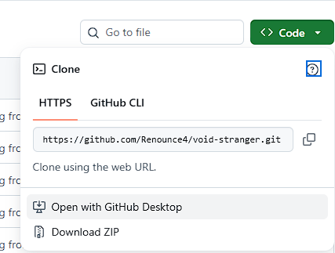
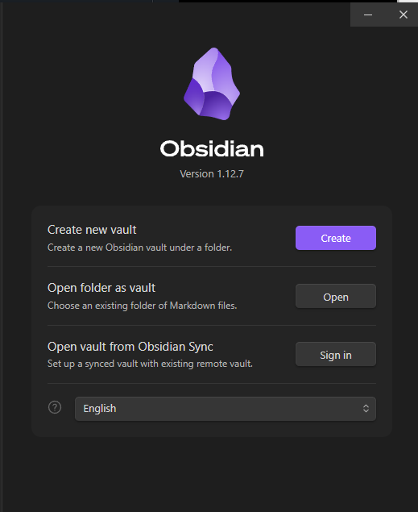

Welcome to [Scapestreet's](https://www.twitch.tv/scapestreet) Obsidian notebook for their [Void Stranger](https://store.steampowered.com/app/2121980/Void_Stranger/) playthrough!

The intent of this git repo is to allow viewers to pull down the latest version of the notebook each stream so they can see what is known and follow along with all the fun.

# Setup
First, you will need to make sure you have the following installed on your computer:
1. [Obsidian](https://obsidian.md/download)
2. Git (recommend [GitHub Desktop](https://github.com/apps/desktop) for anyone unfamiliar with the git tool)

## Git
Once you have those installed, follow the directions for your installed git tool to clone this repository locally and pull the latest changes.

If you chose to use GitHub Desktop, there is a dedicated button on the repo to open it up in that tool.

## Obsidian
Once the repo for this notebook is on your machine, all you have left to do is open it within Obsidian. To do so, launch the app, and select the option to open an existing folder as a Vault. 

Navigate to your repository folder, wherever you cloned it to in the previous step, and select the top level folder which contains this very README.md file. Confirm, and you should be good to go!

Feel free to reach out with any issues or questions (and certainly join me on stream at https://www.twitch.tv/scapestreet)